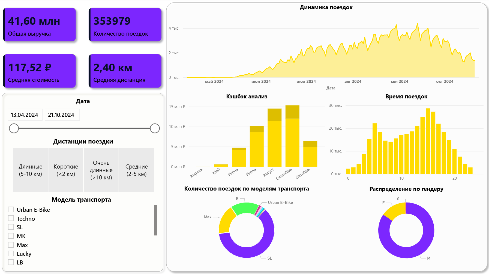

# Проект посвящён анализу данных сервиса проката электросамокатов

# Краткое описание
Проект — анализ данных сервиса проката электросамокатов. Цель — очистить и подготовить данные, провести исследовательский анализ (EDA), визуализировать ключевые метрики (временные тренды, распределения по моделям/пользователям/часам), проанализировать влияние кешбэка/стоимости поездок и подготовить интерактивный прототип дашборда для оперативного мониторинга.

Датасет Т-банка. Данные охватывают сезон аренды самокатов 2024 года (с апреля по октябрь 2024).

# Интерпретация и бизнес-рекомендации

- Сезонная стратегия. Поскольку пик приходится на лето/раннюю осень — стоит планировать промо/операционные ресурсы (зарядка, обслуживание) под сезонный рост, а в межсезонье использовать специальные акции/подписки для выравнивания спроса.

- Кэшбэк и ROI. Сумма кешбэка значительная (~10 млн ₽). Рекомендуется посчитать ROI кампаний: сколько поездок и сколько выручки было завязано/стимулировано кешбэком, и сравнить стоимость привлечения/удержания с пожизненной ценностью пользователя (LTV).

- Оптимизация парка. Основное использование приходится на 1–2 модели (SL и т.п.). Стоит оптимизировать склад/ремонт и распределять зарядные станции и запчасти под реальную структуру флота.

- Часовые паттерны и ценообразование. Пиковые часы (14–17) — можно рассмотреть динамическое ценообразование или бонусы в непиковые часы, чтобы улучшить распределение нагрузки.

- Географическая фокусировка. Топ-20 регионов дают 84% поездок → следует фокусировать рост и инфраструктуру на этих регионах. Для выхода в новые регионы — пилотировать с 1–2 точками и измерять показатели по каждой.

# Дашборд в PowerBI:

# Что было сделано мной при анализе репозитория (коротко)

- Просмотрены data_cleaning.ipynb и sales_analysis.ipynb.

- data_cleaning.ipynb: подготовка дат, создание признаков (hour, part_of_day, month, is_weekend), удаление выбросов по distance_km, очистка по кешбэку, сохранение обработанного CSV.

- sales_analysis.ipynb: построение распределений стоимости, динамики поездок, часовых профилей, расчёт суммарного кешбэка, региональный анализ и визуализации.

- Проанализирован предоставленный скриншот дашборда: извлечены KPI и характерные визуальные наблюдения (временной ряд, кешбэк по месяцам, часовой профиль, распределения по моделям и гендеру).

- Зафиксированы ключевые города/регионы (топ-20 составляют ~84% использования).

# Основные выводы

- Общая выручка: ~41,60 млн ₽.

- Количество поездок: ~353 979.

- Средняя стоимость поездки: ~117,52 ₽.

- Средняя дистанция: ~2,40 км.

- Сумма кешбэка (rub): ~10 070 958.85 ₽.

- Динамика: рост поездок с мая по сентябрь 2024 с пиком в конце лета; далее спад.

- Часовой профиль показывает пики дневной/вечерней активности (~14–18 ч).

- Бóльшая доля поездок сосредоточена в топ-20 регионах (~84% всех поездок).

- Доминирующие модели транспорта: SL (наибольшая доля), затем Max, E и т.д.

- Пользователи преимущественно мужского пола (примерно 80–85%).

